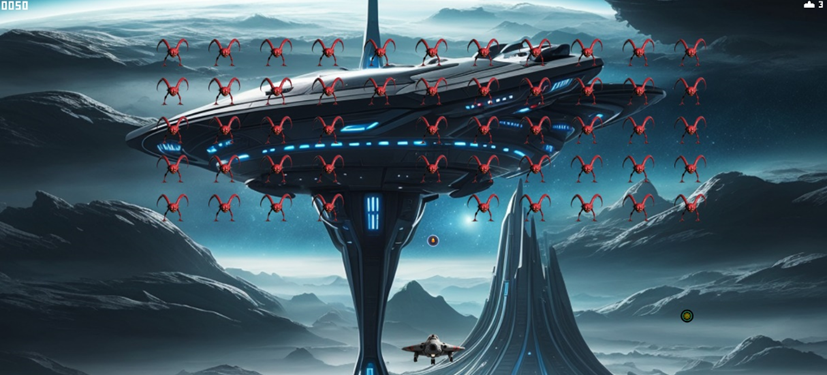
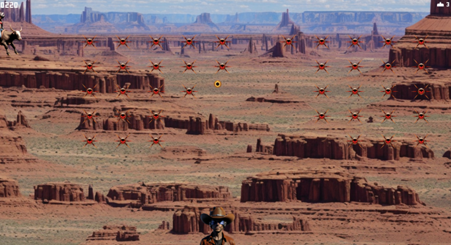

# Prompt Invaders

## Overview
Prompt Invaders is a modern reinterpretation of the classic Space Invaders game, enhanced through the use of advanced AI text-to-image generation. Leveraging the power of Stable Diffusion, the game allows players to dynamically generate personalized visual elements, creating a fully customized gameplay experience based on user input.

## Features
- **Dynamic Procedural Content Generation**: Powered by *Stable Diffusion*, the game generates unique visual assets such as characters, enemies, and backgrounds in real-time, based on player descriptions. This ensures every playthrough is distinct and personalized.

- **Thematic Customization**: At the start of the game, players are prompted to fill in narrative-based themes, defining the appearance of elements like player avatars, enemies, projectiles, and backgrounds. AI then converts these inputs into dynamic game assets.

- **Gallery and Asset Management**: A gallery allows players to view and select from previously generated assets, giving them the freedom to replay with different visual styles or reuse existing assets.

- **Seamless AI Integration**: By embedding AI technology directly into gameplay, players can experience smooth and intuitive interactions that blend traditional arcade action with modern customization.
- **Personalized Gameplay**: Each game session is visually unique, reflecting the player's creativity and choices in a personalized version of the classic *Space Invaders*.

## Technologies Used
- **Unity**: The primary game development platform used for gameplay mechanics, UI, and physics.
- **Stable Diffusion**: This AI model is responsible for transforming text-based inputs into customized game visuals.
- **SD WebUI Forge API**: Facilitates the communication between the game and the *Stable Diffusion* AI for real-time image generation.

**Note**: requires stable-diffusion-webui-forge with sd-forge-layerdiffuse plugin running in the background with '--api' flag enabled.